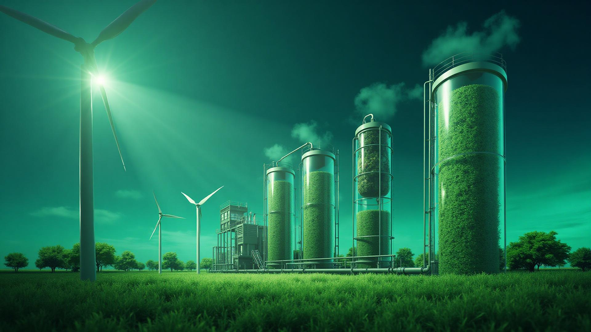

# 🌱 BioMet - Plataforma de Consultoría en Biometano



## 📋 Descripción del Proyecto

BioMet es una plataforma web desarrollada como proyecto universitario para la **Universidad ICESI** (Facultad de Ingeniería, Diseño y Ciencias Aplicadas). 

Nuestro objetivo es proporcionar consultoría integral en biometano, ayudando a distribuidores de GNV, gas natural y usuarios domésticos a realizar una transición energética sostenible.

## 🎯 Propuesta de Valor

- **Independencia Energética**: Reducción de dependencia del gas fósil importado
- **Estabilidad de Precios**: Protección contra la volatilidad del mercado internacional
- **Cumplimiento Regulatorio**: Adelanto a las presiones gubernamentales
- **Impacto Ambiental Positivo**: Contribución a la economía circular

## 🚀 Tecnologías Utilizadas

Este proyecto está construido con tecnologías modernas:

- ⚡ **Vite** - Build tool ultrarrápido
- ⚛️ **React 18** - Biblioteca de UI
- 📘 **TypeScript** - Tipado estático
- 🎨 **Tailwind CSS** - Framework de estilos
- 🧩 **shadcn/ui** - Componentes UI accesibles
- 📊 **React Query** - Manejo de estado del servidor
- 🎭 **Lucide Icons** - Iconos modernos
- 📋 **React Hook Form + Zod** - Formularios y validación

## 💻 Instalación y Desarrollo

### Requisitos Previos

- Node.js (versión 18 o superior)
- npm o pnpm

### Pasos para Ejecutar Localmente

```bash
# 1. Clonar el repositorio
git clone <URL_DEL_REPOSITORIO>

# 2. Navegar al directorio del proyecto
cd biomet

# 3. Instalar dependencias
npm install

# 4. Iniciar servidor de desarrollo
npm run dev

# 5. Abrir en el navegador
# http://localhost:5173
```

### Scripts Disponibles

```bash
npm run dev      # Inicia el servidor de desarrollo
npm run build    # Construye para producción
npm run preview  # Vista previa de la build de producción
npm run lint     # Ejecuta el linter
```

## 📂 Estructura del Proyecto

```
biomet/
├── src/
│   ├── assets/          # Imágenes y recursos estáticos
│   ├── components/      # Componentes React
│   │   ├── ui/         # Componentes de UI reutilizables
│   │   ├── Hero.tsx
│   │   ├── Features.tsx
│   │   ├── ValueProposition.tsx
│   │   ├── ContactForm.tsx
│   │   └── Footer.tsx
│   ├── hooks/          # Custom hooks
│   ├── lib/            # Utilidades y helpers
│   ├── pages/          # Páginas de la aplicación
│   └── main.tsx        # Punto de entrada
├── public/             # Archivos públicos
└── package.json
```

## 🌟 Características Principales

- ✅ Diseño responsive y moderno
- ✅ Animaciones suaves y profesionales
- ✅ Formulario de contacto con validación
- ✅ Sección de características y servicios
- ✅ Propuesta de valor clara
- ✅ Optimizado para rendimiento
- ✅ Accesibilidad (WCAG)

## 🎓 Proyecto Universitario

**Universidad**: ICESI  
**Facultad**: Ingeniería, Diseño y Ciencias Aplicadas  
**Ubicación**: Cali, Valle del Cauca, Colombia

## 📞 Contacto

- **Email**: contacto@biomet.com
- **Teléfono**: +57 300 123 4567
- **Ubicación**: Cali, Valle del Cauca, Colombia

## 📄 Licencia

Este proyecto es de uso académico para la Universidad ICESI.

---

**Desarrollado con 💚 para un futuro más sostenible**
